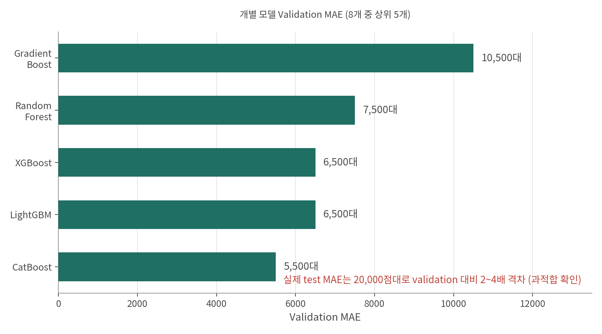
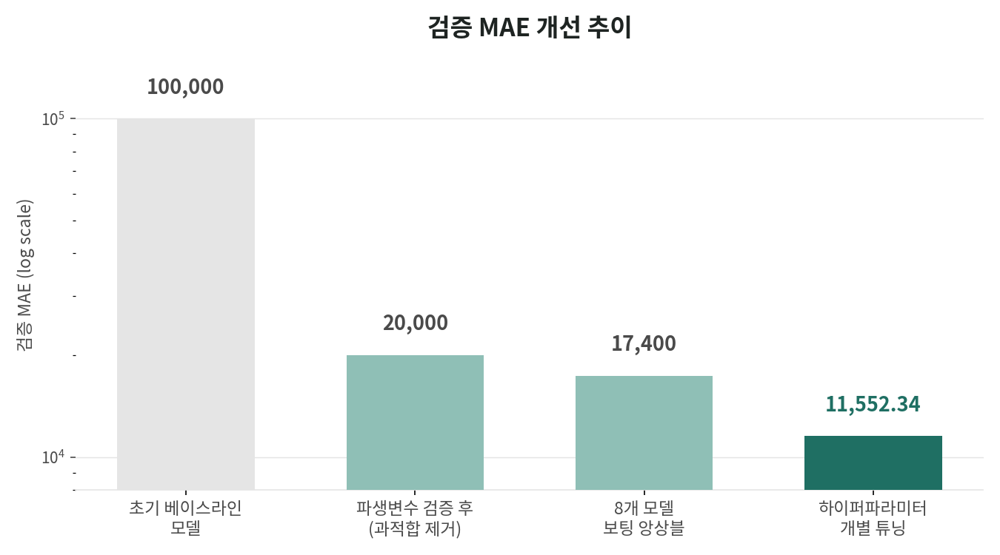

# 🏠 아파트 실거래가 예측 (데이콘 해커톤 2위)

수원대학교 데이터 청년 캠퍼스 프로그램 중 진행한 예비 프로젝트로, 데이콘에서 주최한
[아파트 실거래가 예측 해커톤](https://dacon.io/competitions/open/236130)에 5인 팀으로 참가해 **16팀 중 2위**를 기록했습니다.

## 배경 / 목표 / 성공 기준
- **배경**: 실거래가는 면적·층·건축연도가 비슷해도 단지별 편차가 커서, 매수자가 제시된 가격의 적정성을 스스로 판단하기 어렵다.
- **목표**: 공개된 기본 정보(전용면적·층수·건축연도·거래연월)만으로 개별 거래의 적정가를 예측하는 모델을 만든다.
- **성공 기준**: 대회 평가지표인 MAE를 기준으로, 초기 접근 대비 오차를 유의하게 낮춘다.

초기에는 단일 모델(LGBM)로 접근해 리더보드 하위권에 머물렀지만, 성격이 다른 8개의 회귀 모델을 결합하는 **보팅 앙상블**을 제안·구현한 뒤 예측 오차가 크게 개선되며 순위가 상승했습니다.

## 🔍 접근 방식

### 1) 전처리
- 예측에 사용할 변수만 선택: `전용면적`, `층수`, `건축연도`, `거래연월`
- 거래연월(YYYYMM)을 `거래연도` / `거래월`로 분리해 모델이 계절성·연도 트렌드를 학습할 수 있도록 처리
- 시군구+아파트명 조합, 면적 구간화 등 파생변수를 추가해봤으나 오히려 MAE가 악화되는 것을 확인, 단순 변수로 복귀

### 2) 모델링 — 보팅 앙상블
서로 다른 성격의 회귀 모델 8개를 각각 하이퍼파라미터 튜닝한 뒤, `VotingRegressor`로 결합해 예측값을 평균했습니다.

| 모델 | 역할 |
|---|---|
| LightGBM | 빠른 학습 속도와 높은 정확도 |
| Random Forest | 과적합 방지, 안정적인 예측 |
| XGBoost | 정교한 부스팅 기반 예측 |
| CatBoost | MAE를 손실함수로 직접 최적화 |
| Ridge | 선형 관계 포착, 정규화로 과적합 방지 |
| Gradient Boosting | 순차적 오차 보정 |
| SVR | 비선형 관계 포착 |
| AdaBoost | 약한 학습기 결합으로 예측력 보완 |

단일 모델 대비, 서로 다른 모델의 예측을 결합함으로써 개별 모델의 편향을 상쇄시켜 예측 안정성을 높이는 것이 핵심 아이디어였습니다. 보팅 앙상블 검증 결과와 하이퍼파라미터 조정은 팀원들과 함께 반복적으로 실험하며 진행했습니다.

## 📊 결과

| 지표 | 값 |
|---|---|
| 검증 데이터 MAE (보팅 앙상블) | **11,552** |
| 최종 순위 | 2위 / 16팀 |




**예측 결과 예시** (`voting_ensemble.csv`)

| id | transaction_real_price |
|---|---|
| TEST_0000 | 217,673.7 |
| TEST_0001 | 188,109.4 |
| TEST_0002 | 256,284.4 |
| TEST_0003 | 258,599.6 |

## 📁 파일 구성
```
01_apartment_price_prediction/
 ├─ README.md
 ├─ requirements.txt
 ├─ apartment_price_prediction.py   # 전처리 ~ 모델링 ~ 예측 전체 파이프라인
 ├─ data/
 │   └─ README.md                  # 데이터 출처·컬럼 설명
 └─ images/
     ├─ apartment_overfit_gap.png  # 검증-테스트 MAE 괴리(과적합) 시각화
     └─ apartment_mae_progress.png # 튜닝 전후 MAE 개선 그래프
```

## ▶️ 실행 방법
```bash
pip install -r requirements.txt

python apartment_price_prediction.py
```
> `train.csv`, `test.csv`, `sample_submission.csv`는 [데이콘 대회 페이지](https://dacon.io/competitions/open/236130)에서 내려받아 같은 폴더에 위치시켜야 합니다.

## 🛠 사용 기술
`Python` `Pandas` `Scikit-learn` `LightGBM` `XGBoost` `CatBoost` `Voting Ensemble`

## 👤 본인 역할 (5인 팀)
- 파생변수 추가가 오히려 MAE를 악화시키는 것을 직접 검증, 데이터 근거로 단순 변수 유지 판단 주도
- 예측 오차 개선이 정체된 상황에서 **보팅 앙상블 기법을 제안하고 직접 구현**
- 8개 모델 하이퍼파라미터 튜닝 — 앙상블 결과 공유와 튜닝은 팀원들과 함께 반복 실험
- 팀 코드 공유, 진행 상황 관리, 발표 자료 정리

## 💡 배운 점
문제 해결이 막혔을 때 기존 방식을 더 다듬기보다 접근 자체를 전환하는 것이 효과적일 수 있다는 것을 체감했습니다. 성과가 나오지 않아 팀 사기가 저하된 상황에서, 명확한 수치적 근거(MAE 개선)가 팀을 다시 움직이게 하는 힘이 된다는 것도 배웠습니다.

## 🔎 한계 / 아쉬운 점
- 파생변수 추가가 왜 MAE를 악화시켰는지 개별 변수 기여도까지는 확인하지 못했고, 변수를 되돌리는 선택으로 마무리했다.
- 교차검증 설계와 random seed 고정, 데이터 누수 점검을 체계적으로 하지 않아 validation 성능이 test에서 재현될지 확신하기 어려웠다.
- 고가 구간은 학습 데이터가 적어 오차가 컸을 가능성이 있으나, 가격 구간별 오차를 분리해 확인하지 않았다.

## 🔁 다시 한다면
- 변수를 추가·제거하기 전에 SHAP 등으로 기여도를 먼저 확인한 뒤 판단하겠다.
- 가격 구간별 MAE 표를 만들어 어디서 오차가 발생하는지 특정하고, 고가 구간을 따로 다루는 방법을 비교하겠다.
- 8개 모델을 단순 평균이 아니라 검증 성능 기반 가중 보팅으로 결합했을 때의 차이를 실험하겠다.
