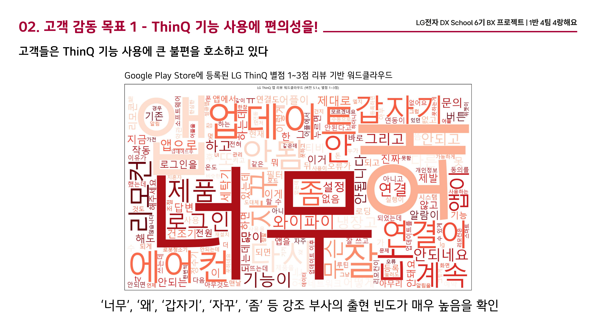
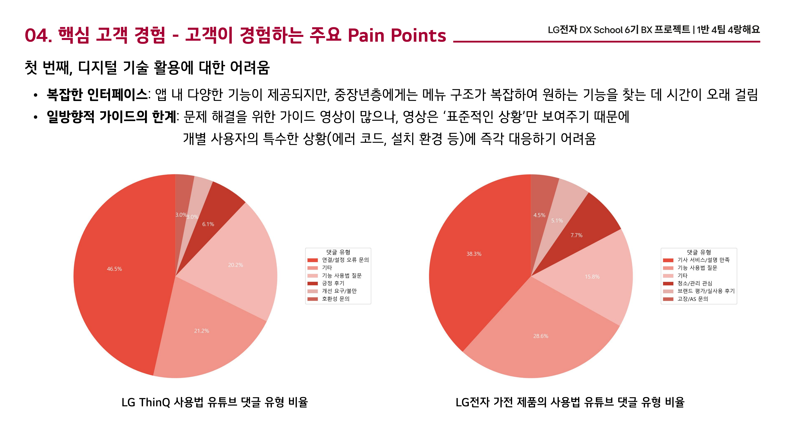

# 💡 LG ThinQ 메이트 - LG전자 DX School 6기 BX 프로젝트 (5인 팀 · 우수상 2위 / 10팀 참가)

LG ThinQ의 낮은 재방문율 문제를 데이터로 확인하고, 중장년층 고객의 정서적 니즈까지 결합한
커뮤니티형 솔루션 'LG ThinQ 메이트'를 기획한 프로젝트입니다.

이 저장소는 문제 정의를 뒷받침하는 데이터 수집·분석 코드를 담고 있습니다.

## 배경 / 목표 / 성공 기준
- **배경**: ThinQ는 경쟁 서비스보다 설치율은 높은데, 실제로 쓰는 사람은 적었습니다.
- **미션(주어진 과제)**: "어떻게 하면 고객이 LG와 하루에 한 번은 만날 수 있을까?"
- **팀이 재정의한 문제**: 원인이 "중장년층이 디지털에 약해서"가 아니라 "기능이 복잡하고 정서적 니즈가 안 채워져서"라고 다시 정의했습니다.
- **성공 기준**: 이 재정의를 커뮤니티·유튜브 댓글·앱 리뷰, 3개의 독립적인 데이터 소스로 교차 검증해보기로 했습니다.

## 🔍 분석 구성 (5인 팀, 데이터분석 담당)

### 1) `82cook_crawling.py` - 5060 세대 커뮤니티 관심사 분석
- **목적**: 5060 세대가 주로 활동하는 커뮤니티에서 어떤 주제로 소통하는지 파악하고, 여기서 나온 핵심 주제를 ThinQ 라운지 콘텐츠 구성에 반영
- **방법**: 82쿡 카페 게시판(엔지토크/키친토크/요리물음표 등) 게시글 제목을 2024년 이후 기준으로 크롤링(하루 만에 3,010건 수집) → 정규표현식으로 노이즈 제거 → KoNLPy(Okt) 형태소 분석 → 워드클라우드 시각화
- 우아한 갱년기 카페도 같은 방식으로 진행 (게시판 ID만 교체)

### 2) `youtube_comment_crawling.py` - 공식 가이드 영상의 한계 검증
- **목적**: LG전자 공식 가이드 영상이 실제 사용자 니즈를 충분히 해결하는지 확인
- **방법**: Selenium으로 무한 스크롤과 '더보기' 버튼을 제어해 댓글 전수 수집(하루 만에 99건) → 키워드 딕셔너리 기반 if-elif 구조로 5개 유형(오류 문의/사용법 질문/호환성 문의/개선요구/긍정후기) + 기타로 분류 → 파이차트 시각화
- **결과**: 수집된 댓글의 약 47%가 "연결/설정 오류 문의" 유형. 가이드 영상이 표준적인 상황만 다루는 일방향적 구조라는 걸 뒷받침하는 수치

### 3) `playstore_review_crawling.py` - 정량적 원인 분석
- **목적**: "설치율은 높으나 실사용은 저조하다"는 핵심 난제의 원인을 정량적으로 파악
- **방법**: Google Play Store에서 변화가 컸던 5.1.x 버전의 최근 1년치 리뷰를 하루 만에 963건 수집 → '안 된다', '어렵다' 등 형태소 변용까지 포착하는 정규표현식으로 부정 키워드 비율 산출 → 저평점(1~3점) 리뷰 워드클라우드 시각화




### 4) Performance Trackers - 목표 KPI 설계 (※ 실제 달성 성과 아님, 기획 단계에서 설계한 목표 지표)
사용자 활동 / 디지털 적응 및 신기능 사용 / 커뮤니티·콘텐츠 성과 / 브랜드 충성도 및 정서적 가치, 4개 카테고리로 성과 측정 지표를 설계했습니다.

## 🛠 사용 기술
`Python` `Selenium` `google-play-scraper` `KoNLPy(Okt)` `WordCloud` `Pandas` `Matplotlib` `정규표현식`

## 📁 파일 구성
```
02_lg_thinq_mate/
 ├─ README.md
 ├─ requirements.txt
 ├─ 82cook_crawling.py            # 커뮤니티 게시글 크롤링 + 워드클라우드
 ├─ youtube_comment_crawling.py   # 유튜브 댓글 크롤링 + 유형분류 + 파이차트
 ├─ playstore_review_crawling.py  # 앱 리뷰 크롤링 + 부정키워드분석 + 워드클라우드
 ├─ data/
 │   └─ README.md                 # 데이터 출처·컬럼 설명
 └─ images/
     ├─ thinq_mate_wordcloud.png      # 82쿡 워드클라우드
     └─ thinq_mate_painpoints_pie.png # 유튜브 댓글 유형 파이차트
```

## ▶️ 실행 방법
```bash
pip install -r requirements.txt

# 각 스크립트는 독립적으로 실행 가능
python 82cook_crawling.py
python youtube_comment_crawling.py
python playstore_review_crawling.py
```
> Selenium 실행을 위해 Chrome 브라우저와 크롬 드라이버가 필요합니다 (`selenium` 4.x 이상은 드라이버 자동 관리).
> `youtube_comment_crawling.py`의 `video_urls`는 실제 분석 대상 영상 URL로 교체해서 사용하세요.
> 한글 폰트 경로(`font_path`)는 Windows 기준(`malgun.ttf`)이며, Mac은 `AppleGothic`으로 변경이 필요합니다.

## 👤 본인 역할
- 82쿡·유튜브 댓글 분석은 직접 구현. 플레이스토어 리뷰 분석은 팀원이 구현하는 과정을 계속 논의·지도하며 최종 코드 정리 담당
- 통계청 자료로 팀 내 근거 없는 가설을 반박, 문제 재정의 주도
- 크롤링 설계(무한스크롤 제어, 예외처리)
- 3가지 분석 결과를 바탕으로 최종 솔루션(숏폼 기반 기능 가이드 'ThinQ 찰나') 제안, 솔루션명 'LG ThinQ 메이트' 명명
- 최종 발표 PPT의 Appendix(데이터 분석 파트) 작성

## 🏆 심사 결과
LG전자 DX School 6기 BX 프로젝트, 10팀 참가 중 우수상(2위)을 받았습니다.
심사표 기준 총점 85점(100점 만점). 문제 해석·타겟 고객 정의·데이터 확보 전략은 고득점을 받았고, 데이터 시각화 효과성과 솔루션 구체성은 보완이 필요하다는 평가를 받았습니다.

## 💡 배운 점
데이터 분석 자체보다 "이 데이터가 왜 필요한지"를 먼저 설계하는 게 더 중요하다는 걸 배웠습니다.
"중장년층은 디지털에 약하다"는 흔한 가정을 그대로 받아들이지 않고 커뮤니티·유튜브 댓글·앱 리뷰, 세 소스로 교차 검증한 경험은 이후에도 가설을 세울 때 항상 데이터로 먼저 확인하는 습관으로 이어졌습니다.

## 🔎 한계 / 아쉬운 점
- 유튜브 댓글 유형 분류를 키워드 사전 기반 if-elif로 처리해서, 사전에 없는 표현은 '기타'로 밀려났습니다. 분류 정확도를 사람이 표본 검수한 적은 없습니다.
- 5060 세대를 하나의 동질 집단으로 취급했지만, 실제로는 디지털 활용 역량 편차가 클 수 있습니다.
- 82쿡·우아한 갱년기는 특정 성향의 이용자가 모인 커뮤니티라 표본 편향 가능성이 있습니다.
- 데이터 시각화가 분석 결과를 효과적으로 전달하지 못했다는 심사 피드백을 받았습니다.

## 🔁 다시 한다면
- 댓글 200건을 무작위로 뽑아 수동 라벨링과 자동 분류의 일치율을 먼저 측정하고, 그 수치를 함께 제시하겠습니다.
- 숏폼 가이드와 커뮤니티 중 어느 기능이 문제 해결에 더 기여하는지 분리 검증할 수 있게 A/B 설계를 미리 준비하겠습니다.
- 분석 결과를 더 직관적으로 전달할 수 있는 시각화 방식을 미리 고민하겠습니다.
