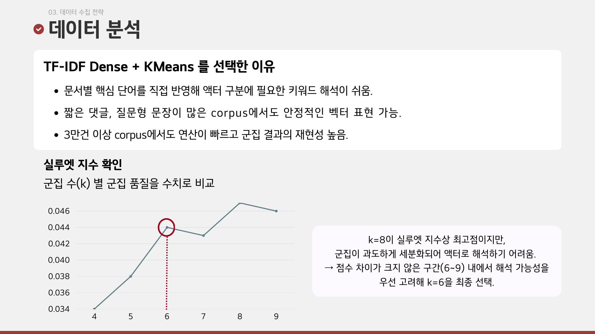
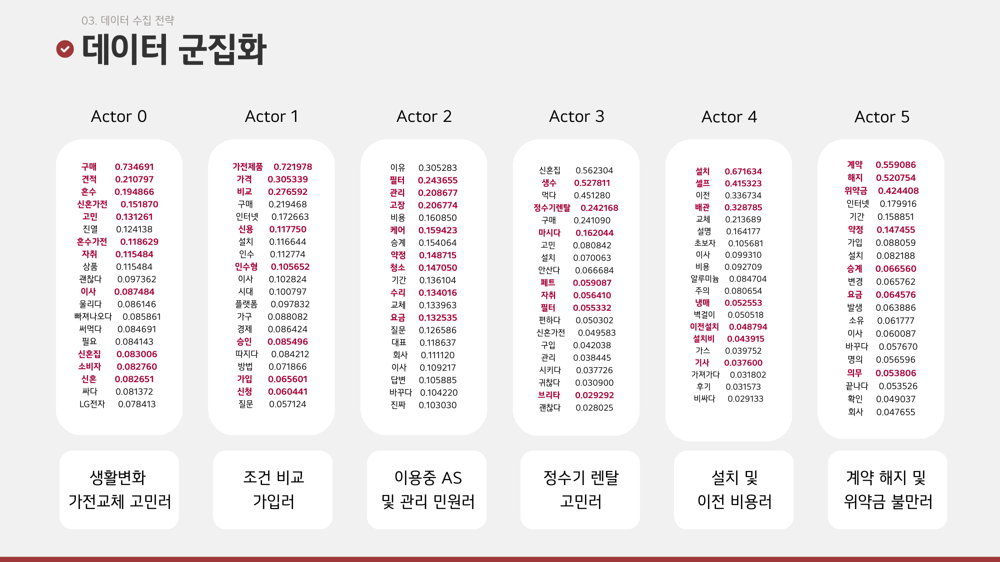

# 🔄 LG LILO — LG전자 DX School 6기 CX 프로젝트 (4인 팀 · 우수상 2위 / 10팀 참가)

가전 구독 시장에서 유독 낮은 MZ세대 전환율의 원인을 텍스트 데이터로 구조화하고,
해지 대신 다음 사용자에게 이어지는 **순환형 구독 승계 서비스 'LG LILO'**를 기획한 프로젝트입니다.

이 레포지토리는 문제 정의와 솔루션 근거를 뒷받침하는 데이터 분석 코드를 담고 있습니다.

## 배경 / 목표 / 성공 기준
- **배경**: 가전 구독 시장은 성장하는데, 구독 친화적일 것으로 여겨지는 MZ세대의 실제 이용률은 오히려 낮다.
- **가설**: 설치·이전 부담과 3~6년 장기 계약 때문에, "생활이 바뀌면 계약을 어떻게 정리하나"가 진입장벽이다.
- **성공 기준**: 2030 채널 텍스트 12만 7천여 건에서 Actor·Action을 구조화해 이 가설을 지지/기각할 근거를 확보한다.

이를 검증하기 위해 디시인사이드, 블라인드, 결혼준비 카페, 블로그, 유튜브 등에서 12만 7천여 건을 수집해 3만 8천여 건으로 정제 후 분석했습니다.

## 🔍 분석 파이프라인 (4인 팀, 데이터분석 담당)

| 순서 | 파일 | 내용 |
|---|---|---|
| 1 | `01_cafe_crawler.py` | directwedding(결혼준비 카페) 게시글·댓글 크롤링 |
| 2 | `02_data_merging_preprocessing.py` | 팀원별 채널(카페/유튜브/블라인드/디시인사이드 등) 수집 데이터 통합 + 1차 전처리 |
| 3 | `03_actor_clustering.py` | TF-IDF + KMeans로 6개 Actor(고객 유형) 도출 |
| 4 | `04_action_topic_modeling.py` | Actor별 LDA 토픽 모델링으로 세부 Action 도출 |
| 5 | `05_sentiment_opportunity_analysis.py` | 감성분석 + Opportunity Score로 개선 우선순위(CAM) 도출 |

> 팀 전체가 크롤링부터 참여했고, 그중 directwedding 카페 크롤링을 담당했습니다.
> 이후 전체 데이터 통합·1차 전처리, Actor/Action 도출, 감성분석·CAM 제작까지 분석 파트를 맡아 진행했습니다.

### 1) 데이터 수집 및 통합
2030 세대가 많이 쓰는 채널(디시인사이드, 블라인드, 결혼준비 카페, 인테리어 카페, 블로그, 유튜브)에서
'#첫자취가전', '#신혼가전', '#가전구독후기' 등 관련 키워드로 12만 7천여 건을 수집, 결측치·중복 제거 등 1차 정제를 거쳐 3만 8천여 건으로 정리했습니다.

### 2) Actor 도출 — TF-IDF + KMeans
Kiwi 형태소 분석 후 TF-IDF로 벡터화하고, k=4~9 구간에서 실루엣 지수를 비교했습니다.

| k | 실루엣 지수 |
|---|---|
| 4 | 0.0335 |
| 5 | 0.0375 |
| 6 | 0.0441 |
| 7 | 0.0435 |
| 8 | **0.0468 (최고점)** |
| 9 | 0.0462 |



지수상으로는 k=8(0.0468)이 최고점이었지만 군집이 과도하게 세분화되어
해석이 어려워, 점수 차이가 크지 않은 구간(0.0441 vs 0.0468)에서 **k=6**을 최종 선택했습니다.



도출된 6개 Actor:

| Actor | 특징 |
|---|---|
| Actor 0 | 생활변화 가전교체 고민러 (메인 페르소나 — 김수아, 32세) |
| Actor 1 | 조건비교 가입러 — 구매·할부·구독·렌탈 총비용을 비교하는 실속형 |
| Actor 2 | 이용 중 AS 및 관리 민원러 — 필터·청소·AS 등 관리 품질을 중시 |
| Actor 3 | 정수기 렌탈 고민러 — 생수 vs 정수기 렌탈을 생활 패턴 기준으로 비교 |
| Actor 4 | 설치 및 이전비용러 — 이사 시 설치비·배관·철거 조건을 꼼꼼히 확인 |
| Actor 5 | 계약해지 및 위약금 불만러 — 해지 대신 승계·양도 대안을 먼저 탐색 |

### 3) Action 도출 — LDA 토픽 모델링
Actor별로 Perplexity/Coherence를 비교해 개별적으로 토픽 수를 선정하고(passes=20, iterations=50),
문서별 대표 토픽을 Action으로 라벨링했습니다. pyLDAvis 표시 번호와 LDA 모델 내부 토픽 번호가
다르게 정렬되는 경우가 있어, 이를 수동으로 대응시켜 최종 Action 번호를 확정했습니다.

### 4) 감성분석 및 Opportunity Score (CAM)
KNU 감성사전으로 Actor-Action 조합별 만족도(Satisfaction, -10~10)를 계산하고, 전체 문서 대비
등장 비율로 중요도(Importance, 0~10)를 산출했습니다.

```
Opportunity Score = Importance + max(Importance − Satisfaction, 0)
```

중요도는 높은데 만족도는 낮은 조합일수록 점수가 커지도록 설계해 개선 우선순위를 정량화했습니다.
예를 들어 Actor 5(계약해지 불만러)의 "가입 시 사은품·할인반환금까지 추가 청구되는 문제"는
감성 점수 -7.11로 가장 낮은 축에 속해 핵심 기회 영역으로 도출됐고, 이는 LILO의 **공식 승계 마켓**
설계로 직접 이어졌습니다.

**Opportunity Score 상위 3개 (전부 메인 페르소나 Actor 0)**

| 순위 | Actor_Action | 만족도 | 중요도 | Opportunity Score |
|---|---|---|---|---|
| 1 | Actor0_Action1 | -5.69 | 10.00 | **25.69** |
| 2 | Actor0_Action2 | -3.63 | 5.11 | **13.85** |
| 3 | Actor0_Action3 | -7.36 | 3.14 | **13.64** |

메인 페르소나(Actor 0)의 세 가지 Action이 모두 상위권을 차지해, 메인 페르소나의 페인포인트가 가장 시급한 기회 영역이라는 판단에 힘을 실어주었습니다.

## 🛠 사용 기술
`Python` `Kiwi` `Okt` `TF-IDF` `KMeans` `LDA(gensim)` `KNU 감성사전` `MinMaxScaler` `Selenium`

## 📁 파일 구성
```
03_lg_lilo/
 ├─ README.md
 ├─ requirements.txt
 ├─ 01_cafe_crawler.py
 ├─ 02_data_merging_preprocessing.py
 ├─ 03_actor_clustering.py
 ├─ 04_action_topic_modeling.py
 ├─ 05_sentiment_opportunity_analysis.py
 ├─ data/
 │   └─ README.md                          # 데이터 출처·컬럼 설명, KNU 감성사전 안내
 └─ images/
     ├─ lilo_silhouette.png                # k별 실루엣 지수 그래프
     └─ lilo_actor_clusters.png            # 6개 Actor 군집 시각화
```

## ▶️ 실행 방법
```bash
pip install -r requirements.txt

python 01_cafe_crawler.py
python 02_data_merging_preprocessing.py
python 03_actor_clustering.py
python 04_action_topic_modeling.py
python 05_sentiment_opportunity_analysis.py
```
> 각 스크립트는 이전 단계의 출력 파일(pickle/csv)을 입력으로 받는 순차 파이프라인입니다.
> `05_sentiment_opportunity_analysis.py`는 KNU 감성사전(`SentiWord_info.json`)이 별도로 필요합니다.

## 👤 본인 역할
- directwedding 카페 크롤링 담당 (팀 전체는 채널별로 분담해 크롤링 진행)
- 팀원별 수집 데이터 통합 및 1차 전처리
- TF-IDF + KMeans 기반 Actor 도출, 통계적 최적값(k=8) 대신 해석 가능성 기준 k=6 최종 선택 주도
- Actor별 LDA 토픽 모델링으로 Action 도출
- 감성분석 및 Opportunity Score 산출, CAM(기회영역) 제작

## 🏆 심사 결과
LG전자 DX School 6기 CX 프로젝트, **10팀 참가 중 우수상(2위)**.
심사위원 총평은 "참 잘했다"였고, 구체적으로는 다음과 같은 평가를 받았습니다.

- **잘한 점**: 구독의 Pain point를 데이터 기반으로 명확히 확인함 / 분석 방법에 대한 근거를 들어 논리를 확보함 / 실루엣 지수 최고점(k=8) 대신 해석 가능성을 고려해 k=6을 선택한 판단이 우수함 / 순환형 서비스임을 강조해 서비스 루프를 완성함 / 대표 페르소나를 심층적이고 완성도 있게 분석함
- **보완 필요 지적**: 실제 운영 비용 및 승계 시 구독료 산정 등 비즈니스 운영 관점의 보완 필요 / 중고 제품 승계에 따른 리스크 보완 필요 / Actor가 타겟 고객 특성을 중복 없이 반영했는지 재점검 필요 / 채널별·키워드별 데이터 비중을 함께 제시하면 표본 편향 판단이 쉬워짐 / TF-IDF는 문맥을 반영하지 못하는 한계가 있어 unigram 대신 n-gram 활용 고려 / 마이데이터 활용 시 고객 동의·개인정보 범위 추가 고려 필요

## 💡 배운 점
Actor 단계에서 키워드를 너무 타이트하게 잡으면 이후 Action 단계에서 데이터가 제대로 나뉘지 않아
되돌아가야 한다는 것을 미니 프로젝트에서 미리 겪어봤고, 이 교훈을 전처리 방식(불용어 처리, 형태소
분석 파라미터)에 반영해 시행착오를 줄일 수 있었습니다. 또한 실루엣 지수 같은 정량 지표가 항상
정답은 아니며, 통계적 최적값과 실제 해석 가능성 사이에서 균형을 잡는 것이 분석가의 판단 영역이라는
것을 체감했습니다.

## 🔎 한계 / 아쉬운 점
- 최종 선택한 k=6의 실루엣 지수는 최고점(k=8, 0.0468)보다 낮고, 0.0468이라는 값 자체가 군집 분리도가 약하다는 것을 뜻한다. 텍스트 데이터 특성상 흔한 수준이지만, 군집 경계가 뚜렷하지 않다는 점은 명시할 필요가 있다.
- pyLDAvis 토픽 번호와 LDA 내부 번호를 수동으로 대응시켜 최종 Action을 확정했다. 사람이 개입한 만큼 재현성이 떨어진다.
- KNU 감성사전이 가전 구독 문맥(위약금, 승계, 설치비 등)을 제대로 반영하는지 검증하지 않았다.
- Opportunity Score 산식과 정규화 방식이 바뀌어도 우선순위가 유지되는지 민감도 분석을 하지 않았다.
- 실제 운영 시 승계 수수료·중고 리스크 등 비즈니스 모델 구체화가 부족하다는 심사 피드백을 받았다.

## 🔁 다시 한다면
- 토픽 번호 대응을 코드로 자동화해 수동 개입을 제거하겠다.
- 도메인 용어 100개를 뽑아 감성사전을 보정한 뒤 결과가 얼마나 달라지는지 비교하겠다.
- 채널별·키워드별 수집 비중을 표로 남겨 표본 편향 가능성을 점검하겠다.
