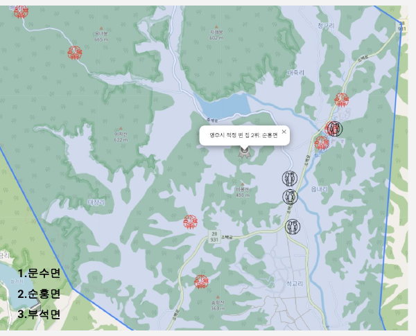
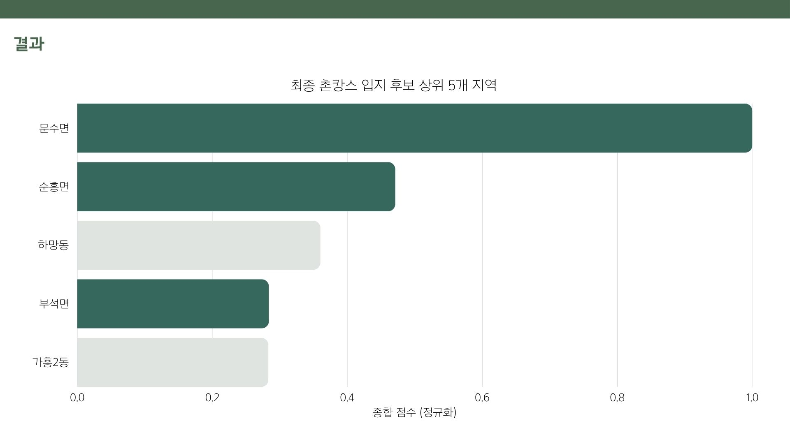

# 🏡 빈집 활용 촌캉스 사업 — 2024 영주시 데이터 분석·활용 공모전 (3인 팀 · 팀장)

영주시의 빈집 문제와 청년 일자리·관광 침체 문제를 동시에 해결하기 위해, 지리 데이터를 기반으로
촌캉스 숙박 사업의 최적 입지를 도출한 프로젝트입니다. 3인 팀에서 팀장을 맡아 주제 선정부터
데이터 분석, 코드 구현, 발표까지 프로젝트 전 과정을 이끌었습니다.

> 대학 캡스톤 수업의 팀 프로젝트로 진행해 영주시 공모전에 참가했습니다. 공모전 자체 수상은 하지 못했으나, 같은 프로젝트로 캡스톤 수업 내에서는 1등을 했습니다.

## 배경 / 목표 / 성공 기준
- **배경**: 영주시는 인구 감소로 인한 빈집 증가 문제를 겪고 있었고(5개년 279동 정비 계획, 17억원 투입), 동시에 청년 일자리 부족과 관광 산업 침체 문제도 안고 있었습니다. 직접 다녀온 촌캉스 여행에서 자차 없이는 접근이 어렵고 주변에 장 볼 곳이 없어 불편했던 경험이 주제 선정의 출발점이었습니다.
- **목표**: 빈집을 촌캉스 숙박시설로 전환할 최적 입지를 데이터로 도출한다.
- **성공 기준**: 제공 가능한 데이터만으로 19개 읍면동을 정량 비교해, 근거를 제시할 수 있는 후보지를 좁힌다.

## 🔍 핵심 제약과 해결 방법
빈집의 정확한 주소는 개인정보 문제로 제공받을 수 없었고, 읍면동 단위 등급별(1-4등급) 빈집
개수 데이터만 주어졌습니다. **19개 읍면동 각각의 행정복지센터 위치를 해당 지역 빈집의 대표
좌표로 삼는 방식**을 직접 제안해 분석을 진행할 수 있는 방법을 찾아냈습니다. 숙박업 전환이
용이한 1,2등급 빈집 총 **[　　]호**를 분석 대상으로 삼았습니다.

## 📊 분석 흐름
1. **데이터 전처리**: 관광지·맛집·빈집·행정복지센터 데이터 정리 (숙박시설은 경쟁시설이므로 관광지 목록에서 제외)
2. **지오코딩**: Google Maps Geocoding API로 주소를 위경도 좌표로 변환
3. **거리 계산**: 하버사인 공식을 변형해 행정복지센터-관광지/맛집 간 실거리 계산
4. **점수화**:
   - 관광지 점수: 인기 순위 기준 정규화
   - 맛집 점수: 총 방문객 수 기준 정규화
   - 빈집 등급 점수: 1등급 50점, 2등급 40점 (3~4등급은 철거 대상이라 제외) 가중치 부여 후 정규화
   ```
   종합 점수 = 관광지 점수 × 맛집 점수 × 빈집 등급 점수
   ```
5. **세부 지점 특정**: 최종 선정된 읍면동 내에서도, 실제 인기 관광지·맛집 좌표의 평균으로 더 구체적인 추천 지점 도출
6. **지도 시각화**: Folium + GeoJSON 행정경계로 최종 결과 시각화

## 🏆 최종 결과
19개 읍면동의 종합 점수를 산출해 최종 후보 3곳을 선정했습니다.




| 순위 | 읍면동 | 종합 점수 |
|---|---|---|
| 1 | 문수면 | 1.000 |
| 2 | 순흥면 | 0.471 |
| 3 | 부석면 | 0.284 |
| - | 하망동 | 0.360 (주변 인프라 접근성 문제로 최종 후보에서 제외) |

## 🛠 사용 기술
`Python` `Pandas` `NumPy` `Google Maps Geocoding API` `Folium` `Scikit-learn(MinMaxScaler)`

## 📁 파일 구성
```
04_yeongju_chonkangs/
 ├─ README.md
 ├─ requirements.txt
 ├─ .env.example
 ├─ chonkangs_location_analysis.py     # 전처리~거리계산~스코어링~GeoJSON 결과지도 전체 파이프라인
 ├─ data/
 │   └─ README.md                     # 데이터 출처·컬럼 설명
 └─ images/
     ├─ chonkangs_geojson_map.png     # Folium 최종 결과 지도
     └─ chonkangs_result.jpg       # 읍면동별 종합 점수 막대그래프
```

## ▶️ 실행 방법 (분석 코드)
```bash
pip install -r requirements.txt

python chonkangs_location_analysis.py
```
> Google Maps Geocoding API 키가 필요합니다 (`.env.example` 참고). 원본 데이터(관광지/맛집/빈집/행정복지센터 csv)는
> 영주시 공모전 측에서 제공한 자료로, 별도 배포용 파일은 포함하지 않았습니다.

## 👤 본인의 역할 (3인 팀, 팀장)
팀장으로서 주제 선정, 분석 방향 설정, 중간보고·최종 발표를 총괄했습니다.
직접 겪은 촌캉스 여행의 불편함에서 주제를 착안했고, 빈집의 정확한 주소를 받을 수 없는 상황에서
행정복지센터를 대리 좌표로 활용하자는 아이디어를 직접 제안했습니다.

초반에는 누가 코드를 가장 잘 짤지 몰라 팀원 3명이 각자 하버사인 거리 계산·스코어링 로직을 따로 작성해 결과를 비교했고, 그중 본인이 작성한 코드가 채택되어 이후 로직 정리·고도화를 이어서 담당했습니다. 이후 지도 시각화와 점수 계산 보완은 팀원 1명이 많이 도와주었고, 팀원 1명은 발표 PPT 제작을 메인으로 맡았습니다.

## 💡 배운 점
원하는 데이터(정확한 주소)를 받을 수 없는 제약 상황에서도, 대체 가능한 데이터(행정복지센터 위치)를
찾아 분석을 이어갈 수 있다는 것을 경험했습니다. 데이터 분석에서는 이상적인 데이터가 항상 주어지지
않으며, 제약 조건 안에서 대안을 찾는 것도 분석가의 역량이라는 점을 배웠습니다.

## 🔎 한계 / 아쉬운 점
- 행정복지센터를 빈집 대표 좌표로 삼았으므로, 실제 빈집 분포와의 공간적 오차가 존재한다. 읍면 면적이 넓을수록 오차가 커진다.
- 종합 점수를 세 점수의 곱으로 정의해, 한 지표가 0에 가까우면 전체 점수가 급락한다. 곱셈 방식과 가중치의 근거를 별도로 검증하지 않았다.
- 자차 이동과 대중교통 접근성을 구분하지 않았다. 프로젝트의 출발점이 "자차 없이는 접근이 어려웠던 경험"이었던 만큼, 이 부분이 반영되지 않은 것이 가장 아쉽다.
- 하망동 제외는 정성 판단이었고, 객관적 기준을 사전에 정의하지 않았다.

## 🔁 다시 한다면
- 가중치를 바꿔가며 순위가 유지되는지 민감도 분석을 수행하고 결과를 함께 제시하겠다.
- 대중교통 정류장 데이터를 별도 지표로 추가해, 원래 문제의식이었던 접근성을 모델에 반영하겠다.
- 제외 기준을 사전에 규칙으로 정의한 뒤 적용하겠다.
